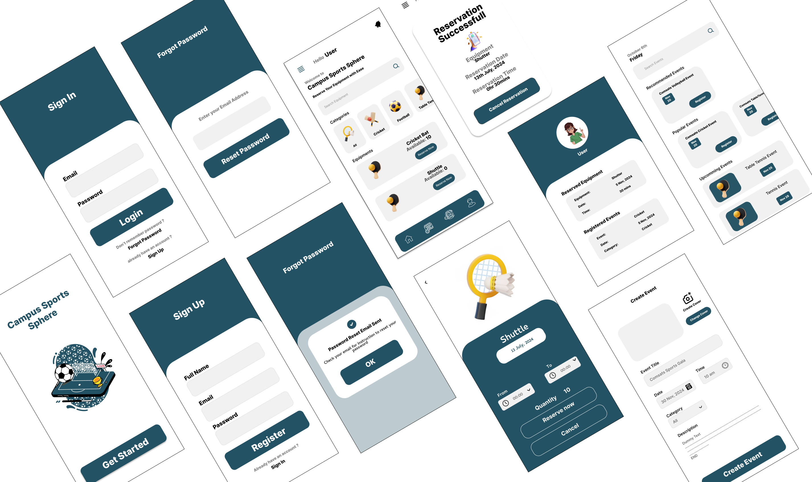
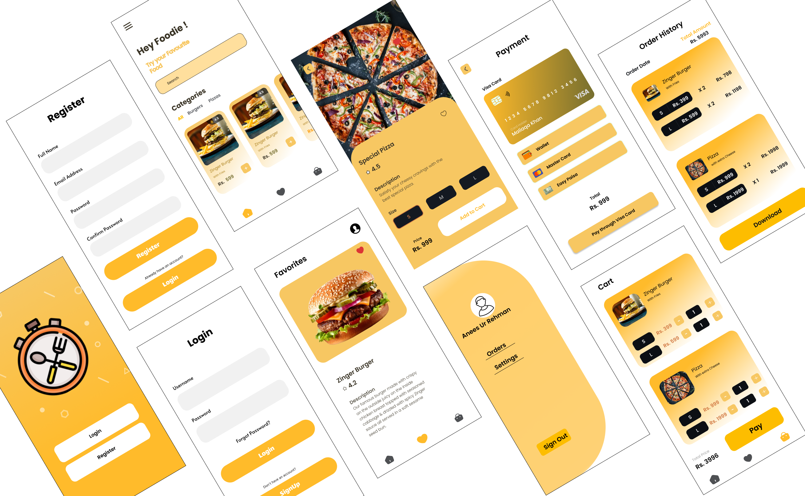
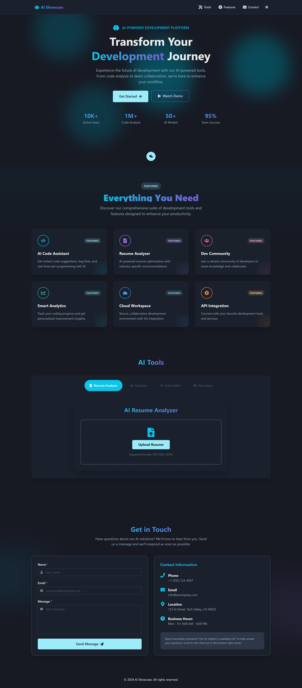
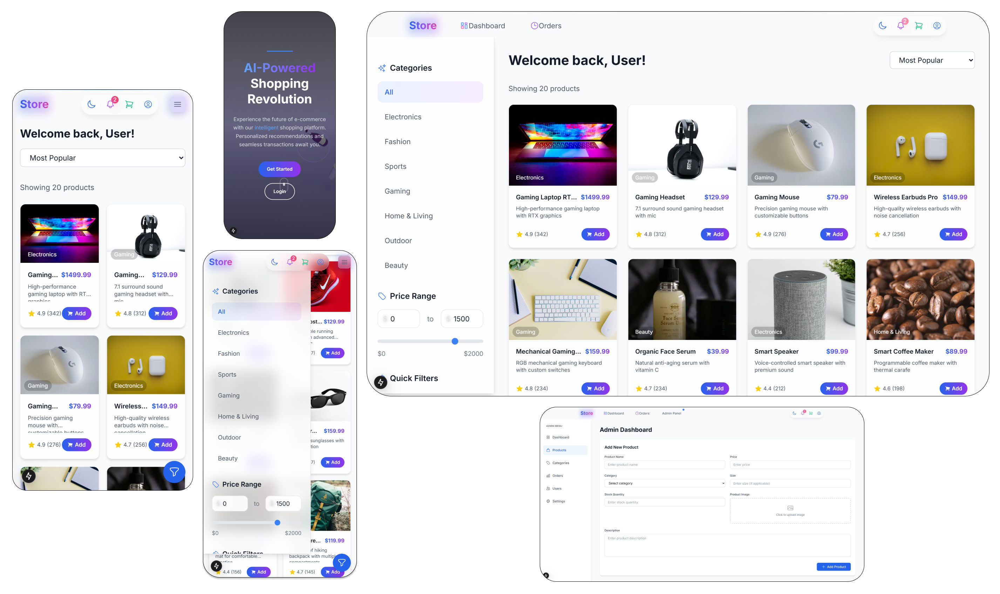
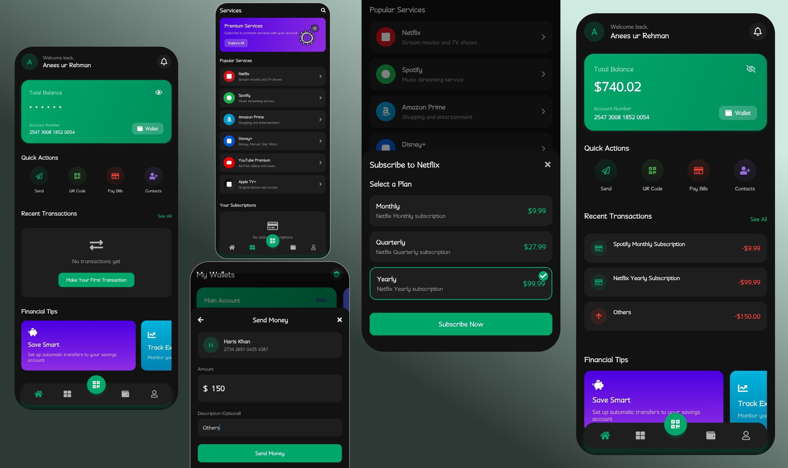

# 👨‍💻 Anees Ur Rehman - Portfolio

  
  
  <h2 style="margin-top: 20px;">Full-Stack Developer</h2>
  
<i>Building digital experiences that solve real-world problems.</i>

  

    
    
    
    
  

 

## 📖 About Me

I'm a passionate **Full-Stack Developer** with over a year of professional experience. I specialize in building modern, responsive, and efficient web and mobile applications. My journey involves mastering both frontend aesthetics and backend logic to deliver complete, user-friendly solutions.

## 🛠️ Tech Stack & Skills

### **Frontend Development**

### **Backend Development**

### **Databases & Cloud**

---

## 🚀 Featured Projects

Here are some of the key projects I've worked on:

### 1. **Campus Sports Sphere** 🏆
*A comprehensive automated sports management system for universities.*

- **Tech Stack:** JavaScript, Python, React, React Native, Node.js, Flask, Firebase
- **Key Features:** Real-time event management, automated scheduling, digital scoreboard, cross-platform mobile app.
- **Achievement:** 1st Position in Career Expo 2024 (Hybrid Category).
- [View Code](https://github.com/araneeskhan/CampusSportsSphere)

### 2. **QuickBite** 🍔
*A modern food delivery platform with real-time tracking.*

- **Tech Stack:** React Native, Firebase, Zustand, AsyncStorage
- **Key Features:** Real-time order tracking, secure payments, restaurant dashboard, dynamic menu management.
- [View Code](https://github.com/araneeskhan/QuickBite)

### 3. **AI Showcase** 🤖
*An integrated AI development platform for developer productivity.*

- **Tech Stack:** React.js, Chakra UI, Framer Motion, Node.js, OpenAI API
- **Key Features:** AI Code Assistant, Resume Analyzer, Dev Community, Smart Analytics.
- [View Code](https://github.com/araneeskhan/AiShowCase)

### 4. **E-Store** 🛍️
*An innovative e-commerce platform with AI-based personalization.*

- **Tech Stack:** Next.js, Chakra UI, Tailwind CSS, Node.js
- **Key Features:** User/Admin dashboards, product recommendations, filtration, secure checkout.
- [View Code](https://github.com/araneeskhan/Store)

### 5. **Bankee** 💳
*A feature-rich mobile banking application.*

- **Tech Stack:** React Native, Expo, Firebase
- **Key Features:** Secure auth, wallet management, easy transfers, transaction history, real-time notifications.
- [View Code](https://github.com/araneeskhan/Bankee)

### 6. **Mafia Empire** 🎮
*A cyberpunk-themed mobile strategy game.*

- **Tech Stack:** React Native, Expo, Firebase, Zustand
- **Key Features:** Gang management, business empire building, territory battles, mission systems.
- [View Code](https://github.com/araneeskhan/MafiaEmpire)

---

## 💻 Portfolio Architecture

This portfolio website is itself a testament to my skills, built using:

- **Framework:** Next.js 15 (React)
- **Language:** TypeScript
- **Styling:** Tailwind CSS
- **Animations:** AOS (Animate On Scroll) & Custom CSS
- **Forms:** Formspree
- **Deployment:** GitHub Pages

## 📬 Contact Me

I'm always open to discussing new projects, creative ideas, or opportunities to be part of your visions.

- **Website:** [araneeskhan.github.io/portfolio](https://araneeskhan.github.io/portfolio/)
- **Email:** [aneesurrehman1358@gmail.com](mailto:aneesurrehman1358@gmail.com)
- **LinkedIn:** [linkedin.com/in/araneeskhan](https://linkedin.com/in/araneeskhan)

---

  
Made with ❤️ by <b>Anees Ur Rehman</b>

  
© 2026 All Rights Reserved

